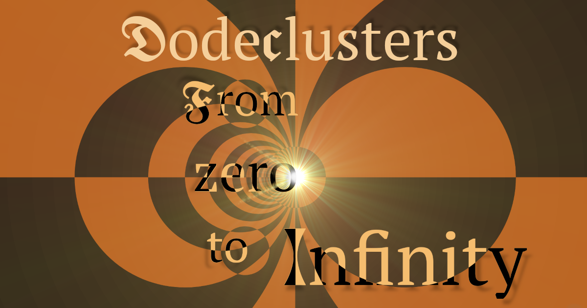

# Dodeclusters ֍

  

### Circle-based vector graphics editor

## Features
♾️ Infinite canvas, infinite zoom, infinite precision\*  
⬤ Powerful circle geometry instrumentation: treating points, circles and straight lines uniformly  
💬 Simple & intuitive design with interactive tips & brief descriptions  
💯 Cross-platform (mobile + desktop + browser)  
🌲 Dynamic expression-dependency tree  
📜 Undo/redo history & auto-save  
💾 Custom YAML-derived file format + Safe SVG export  
✌ Smart gestures: drag-and-drop, swipe coloring & swipe selection, keyboard shortcuts  
🌘 Light/dark mode (*WIP*, for now as a URL argument `?theme=light` or `?theme=dark`)  

\*: objects are related via dynamic expressions and child nodes' formulae are recalculated when moving parents or zooming in/out

Built with [Compose Multiplatform](https://github.com/JetBrains/compose-multiplatform), targeting
- [x] Desktop (Windows, Linux)
- [x] Android 7.0+ (SDK 24+)
- [x] Web (via [Wasm](#Web-Wasm-compatibility))
- [ ] macOS/iOS if ever get an Apple dev account (have to notarize/staple binaries), for now 
  only works as a web app

## End goal
Combine interactive designs ~ Geogebra  
with vector graphics editor ~ Inkscape  
and specific type of animations ~ [Möbius transformations](https://en.wikipedia.org/wiki/M%C3%B6bius_transformation) and possibly [Lie sphere geometry](https://en.wikipedia.org/wiki/Lie_sphere_geometry)  

> [!NOTE]
> This project is in beta, beware of bugs and breaking changes

## Installation
[Live deployed here](https://pier-bezuhoff.github.io/Dodeclusters/) from the `github-pages` branch.  
Executables for Linux, Window and Android can be found in the assets [attached to the latest release](https://github.com/pier-bezuhoff/Dodeclusters/releases/) or [on Google Drive](https://drive.google.com/drive/folders/1abGxbUhnnr4mGyZERKv4ePH--us66Wd4?usp=sharing).

### Windows
1. From [the latest release](https://github.com/pier-bezuhoff/Dodeclusters/releases/tag/v0.3.0) go to `assets` and download `windows.zip`
2. Unarchive it
3. In folder `com.pierbezuhoff.dodeclusters` find file `com.pierbezuhoff.dodeclusters.exe`
4. Run it! That's it~ (it is bundled with JVM)

### Linux
1. From [the latest release](https://github.com/pier-bezuhoff/Dodeclusters/releases/) go to `assets` and download `linux.zip`
2. Unarchive it
3. Go into folder `com.pierbezuhoff.dodeclusters/bin`, you'll find executable file `com.pierbezuhoff.dodeclusters`
4. `chmod +x` it and you can run it as `./com.pierbezuhoff.dodeclusters` (bundled with JVM)

### Android
You can find the apk in the assets [attached to the latest release](https://github.com/pier-bezuhoff/Dodeclusters/releases/).

> [!NOTE]
> Bundled binaries are likely behind web version

## Keyboard shortcuts
- `Ctrl + A`: quickly select/deselect everything
- `Delete`, `Backspace`: delete selected objects
- `Ctrl + V`: duplicate selected objects
- `Ctrl + +`, `Ctrl + =`; `Ctrl + -`; mouse wheel: enlarge/shrink selected objects
- `Ctrl + Z`: undo
- `Ctrl + Y`: redo
- `Esc`: cancel any ongoing constructions

## Build and run via Gradle

> [!IMPORTANT]
> Requires JDK 17

### Run desktop app
`./gradlew :composeApp:run`  
### Run web app (dev)
`./gradlew :composeApp:wasmJsBrowserDevelopmentRun`  

### Package for Windows/macOS/Linux
Build platform-dependent package (e.g. run thru Github Actions using corresponding OS):  
`./gradlew composeApp:createDistributable`  
output directory: `composeApp/build/compose/binaries/main/app/`  
Same + use ProGuard to minify:  
`./gradlew composeApp:createReleaseDistributable`  
output directory: `composeApp/build/compose/binaries/main-release/app/`  

Individually:  
- `./gradlew packageReleaseMsi`  
- `./gradlew packageReleaseDmg` + notarize/register (requires Apple dev acc)  
- `./gradlew packageReleaseDeb`  
output directory: `composeApp/build/compose/binaries/main-release/app/`  

### Package for web browser 
`./gradlew wasmJsBrowserDistribution`  
output directory: `composeApp/build/dist/wasmJs/productionExecutable/`  

#### Package development version for web
`./gradlew wasmJsBrowserDevelopmentExecutableDistribution`
output directory: `composeApp/build/dist/wasmJs/developmentExecutable/`  

### Generate debug .apk for Android
`./gradlew assembleDebug`
output directory: `composeApp/build/outputs/apk/debug/`

## Web Wasm compatibility

To run applications built with Kotlin/Wasm in a browser, you need a browser supporting [wasm garbage collection feature](https://github.com/WebAssembly/gc):  
- For **Chrome** and **Chromium-based** browsers (Edge, Brave etc.), it **should just work** since version 119.
- For **Firefox** 120+ it **should just work**.
- For **Safari** it should work starting from version 18.2+.
- [Relevant Wasm compatibility table.](https://webassembly.org/features/#table-row-gc)

For more information see https://kotl.in/wasm_help/.
